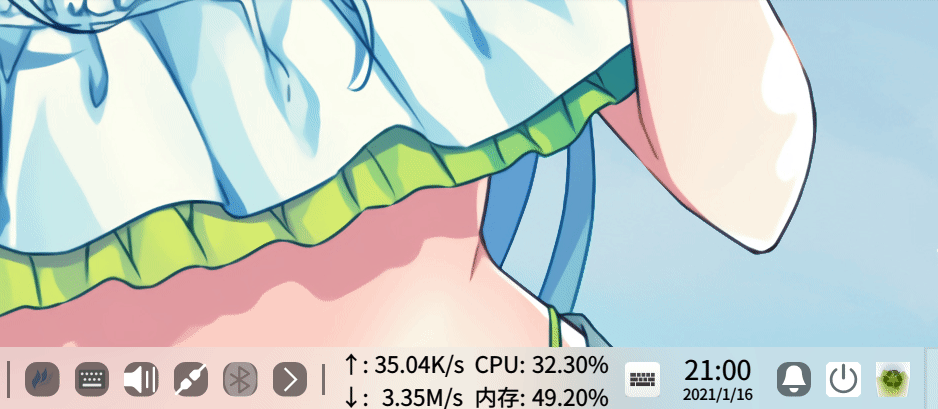
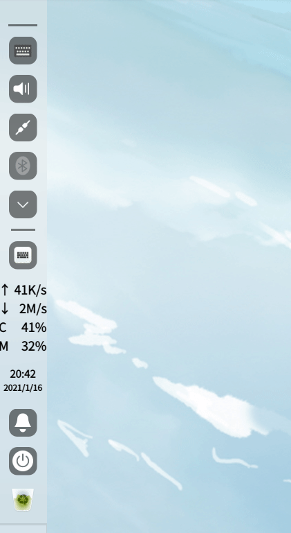
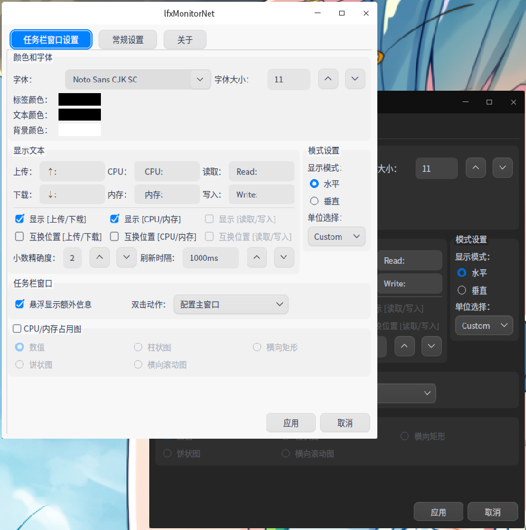
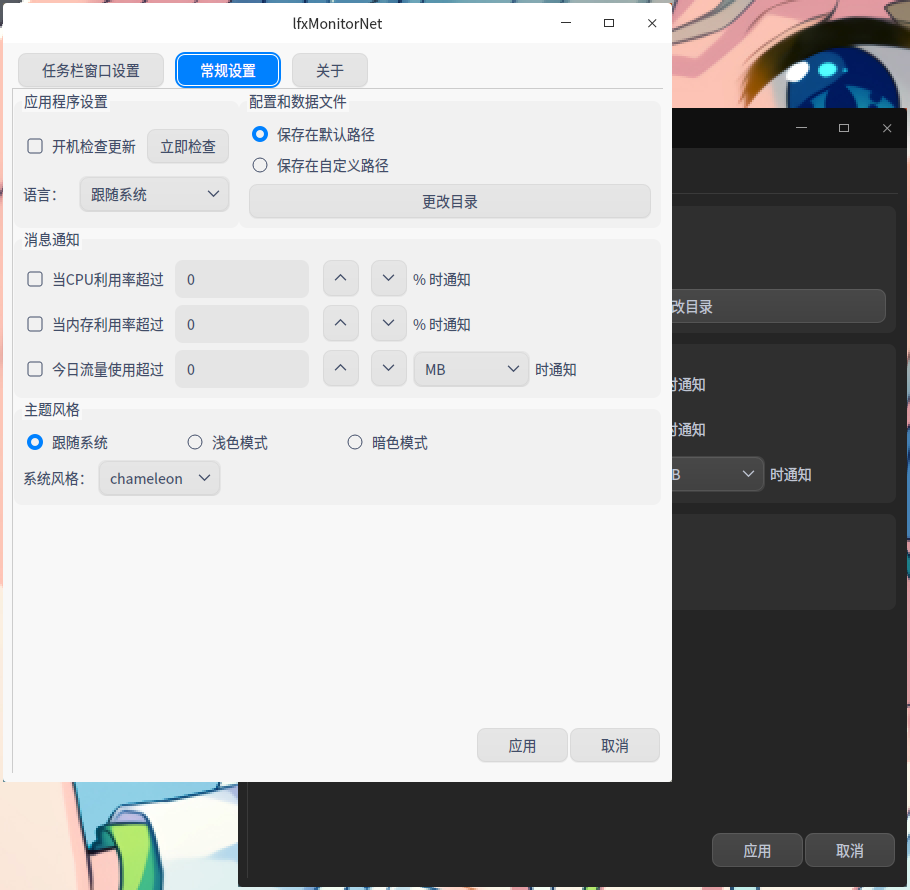
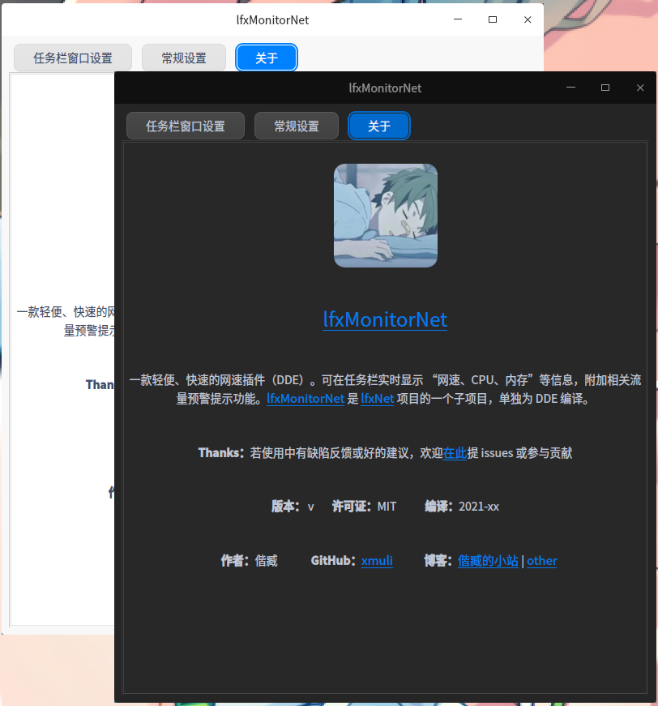

# lfxMonitorNet

<p align="right"><br><a href="README.en_US.md">English</a> | <a href="README.md">简体中文</a> | <a href="README.zh_TW.md">繁體中文</a></p>

      

     

<br>

> `lfxMonitorNet` is a net speed plugin for `dde-dock` and a refactored version of [lfxspeed](https://github.com/xmuli/lfxspeed).

​		At first, it was only for my own use to check the real time internet speed, then open source in the community was liked by everyone, very happy; later decided to refactor and extend it to [lfxsNet](https://github.com/xmuli/lfxsNet), the goal is to write it for `Linux` first, then extend it to `Win` at leisure. and `Mac` platforms, displaying information such as network speed, CPU, MEM, etc. 

 

<br>

## Directory.

- [Background](# Background)
- [Function](#Function)
- [Compile](#compile)
- [screenshot](#screenshot)
- [Author](#Author)
- [Acknowledgements](#Acknowledgements)
- [License](#License)

<br>

### Background

​		The previous [old project](https://github.com/xmuli/lfxspeed) was refactored to fix many bugs and add many new features. When it was in the official `v1.0` version, it was the one that met my expectations and I felt it was done.

<br>

### Features

- Supported features.
  - High split screen display
  - User-defined configuration
  - Installed for all users of the system
  - Displayed prefix content and colors
  - Displayed label content and color
  - Change display font and font size
  - Adaptation of `dock` mode (horizontal and vertical)
  - Automatic unit switching (default smart)
  - Adjusting network rate accuracy
  - Adjusting refresh interval
  - Show additional displayed hover information
  - Left-click on displayed actions (clickable to open `system monitor`)
  - Configuration data export (can be system path | user path)
  - Utilization of `CPU`, memory,; traffic usage warning
  - Theme styles for applications (light and dark modes)
  - Change all style options that come with the system
  

<br>

### Compilation

Using the ``cmake`` build, go to the source directory and execute the following.

```bash
sudo apt install g++ cmake libqt5*-dev libdtk{core,widget,gui}-dev dde-dock-dev # dependencies

mkdir build && cd build # compile
cmake ...
make -j16

sudo make install # Install
```

or directly with `IDE` click the run button, find the generated directory `/dde-dock-plugin` and copy the shared libraries manually: `sudo cp liblfxMonitorNet.so /usr/lib/dde-dock/plugins`.

<br>

**Note:** If it doesn't work, execute `killall dde-dock` to restart the taskbar and it will take effect

<br>

### Screenshot

Set up personalization, for more screenshot effects see: [link](https://github.com/xmuli/lfxNet/tree/master/docs) 


 

 

 


<br>

### Author

[偕臧](https://github.com/xmuli) 

<br>

### Acknowledgements

[流年匆忙](https://github.com/justforlxz)、[zccrs](https://github.com/zccrs)、

<br>

### License


This project is distributed and used based on the `MIT` protocol. For more information, see the [License](.. /LICENSE).

